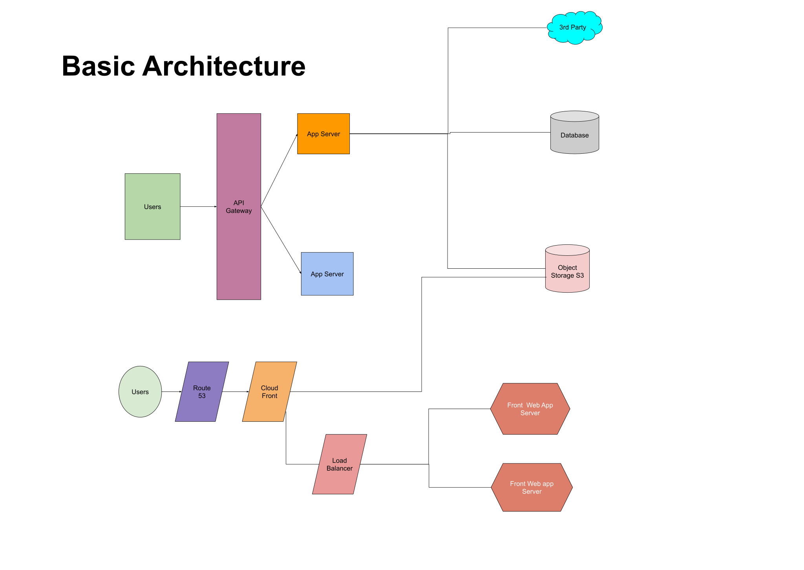
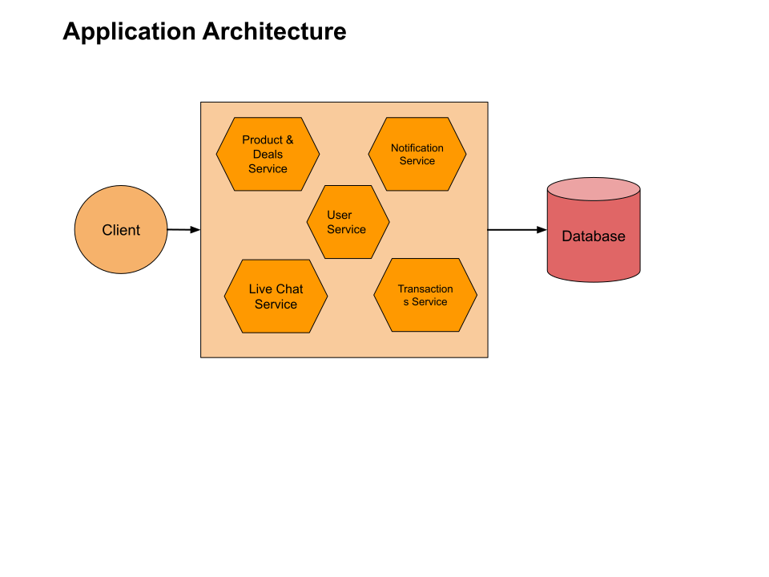

# NodeJS Microservice with Serverless

# Resale Product Application (like eBay) C2C

Need to build a web application which can facilitate the buy, sale new & used/old products in certain price range. Where seller can post products and advertise it for sale and buyer can search and view product as per choice and buy it online.
Application should provide features to talk to buyer with seller directly without mediator and buy the products by paying the price. Payment system will collect the money of the product and certain % of the final product price will be hold for platform and rest of will be release to seller. Buyer can rate the experience of purchase, seller, delivery etc. The communications of every process will be notify through sms and email notification.

1. Product requirement
2. System Design
3. Technology & Infrastructure selection & Decision
4. Epics: Time Estimation
5. Feasibility & POC
6. TDD & CICD

## Use Cases
- Seller can sale products online.
- Buyer can buy product online.
- Transaction will take place between C2C.
- A commision of % will be charged per final transaction.
- Notification or communication channel needed to collaborate buyer & saler.

SELLER ------> PLATFORM <-------Buyer
                  ^
                  |
                  |
               Payment
               Gateway

## System Design

1. Functional requirements
2. Non Functional requirements
3. Data storage requirements

### Functional requirements

- User Signup / Login functionality
- User verification with OTP
- User can become seller/Buyer
- Seller can Create / Update / Delete products
- Seller can advertise Products
- Buyer can purchase using online payment(Card / Online Banking etc.)
- Seller can receive payout 
- Email / message notification
- Online chat with Seller & Buyer is needed

### Non Functional requirements

- System should be highly available cloud with multiple region because this is C2C portal
- System should maintain best pratices to scale horizontally at any level
- System should design the way can be break down into microservices
- Loosely coupled Services and communications
- It should have mechanism for logging and monitoring to inspect services health & availability
- System should design with documentation for better scope of usablity to understand the architecture & bussiness logic of API usages.
- Should follow CQRS

### Data Storage requirements

- Should consistent or eventually consistent
- Should follow CAP theorem
- Distributed database system & high availability
- High availablity of Object Storage for multiple regions

